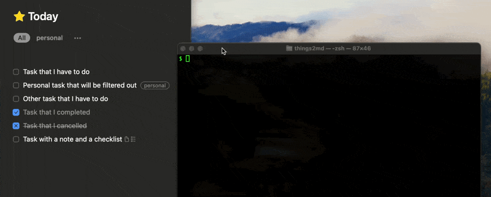
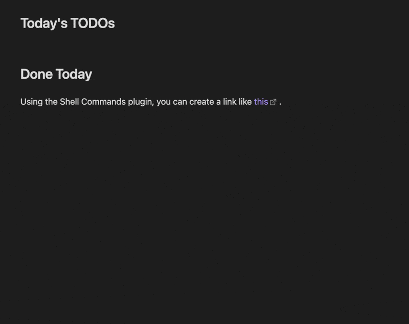

[Things3](https://culturedcode.com/things/) database -> Markdown conversion script (with template support).

[](https://github.com/chrisgurney/things2md/releases)
[](https://opensource.org/licenses/Apache-2.0)



`things2md` was built on [things.py](https://github.com/thingsapi/things.py) and works great with [Obsidian](#usage-with-obsidian).

# Installation

In a terminal, confirm Python is in your path by running:
```
python3 --version
```

You should see output: e.g., `Python 3.11.6`

- You may have to update Python to a newer version, if you run into issues running `things2md` (see later steps). I’m not actually sure what the actual minimum requirement is. Let me know how it works for you!

Get the latest release zip file:
1. On this page: https://github.com/chrisgurney/things2md/releases
2. Download the `Source code (zip)` file for the latest version.

Unzip the file somewhere you intend to run it from (doesn’t matter where).

In a terminal, go to the folder you unzipped it to and run:
```
pip3 install -r requirements.txt
```

Copy `things2md.json.example` to `things2md.json`

- I recommend trying to run it without changing it first, to see if the output suits your needs as-is.

Try running (example):
```
python3 things2md.py --today
```

…which should list out the tasks in your Today list.

Review the documentation and change your `things2md.json` as desired.

# Usage

Execute `things2md.py` without any parameters to see the full list of arguments available:

```
-h, --help            show this help message and exit
--date DATE           Date to get completed tasks for, in ISO format (e.g., 2023-10-07).
--debug               If set will show script debug information.
--due                 If set will show incomplete tasks with deadlines.
--groupby {date,project}
                      How to group the tasks.
--orderby {date,index,project}
                      How to order the tasks.
--project PROJECT     If provided, only tasks for this project are fetched.
--projects            If set will show a list of projects only.
--range RANGE         Relative date range to get completed tasks for (e.g., "today", 
                      "1 day ago", "1 week ago", "this week" which starts on Monday).
                      Completed tasks are relative to midnight of the day requested.
--tag TAG             If provided, only uncompleted tasks with this tag are fetched.
--template TEMPLATE   Name of the template to use from the configuration.
--today               If set will show incomplete tasks in Today.

At least one of these arguments is required: date, due, project, projects, range, tag, today
```

# Quick Start

Get incomplete tasks:

```shell
python3 things2md.py --today
python3 things2md.py --tag "tagname"
python3 things2md.py --project "projectname"
```

Get completed tasks:

```shell
python3 things2md.py --date "2024-03-06"
python3 things2md.py --tag "tagname" --range "this week"
python3 things2md.py --project "projectname" --range "this week"
```

List my projects:

```shell
python3 things2md.py --projects --template "projects"
```

<details><summary>More examples</summary>
<p>

## Listing Completed Tasks

Show tasks completed within the last week, grouped by project, ordered by project:
```shell
python3 things2md.py --range "1 week ago" --groupby "project" --orderby "project"
```

Show tasks completed today:
```shell
python3 things2md.py --range "today"
```

Show tasks completed today, and omit subtasks and notes:
```shell
python3 things2md.py --range "today" --template "simple"
```

BETA: Show tasks completed on a specific date (in ISO format). Known issue: I think due to dates being stored in UTC, if the completion date falls near midnight, it may show up if you're querying tasks for the next day.
```shell
python3 things2md.py --date "2024-02-25"
```

Show tasks completed yesterday:
```shell
python3 things2md.py --range "yesterday"
```

...and ordered by project, but omit subtasks, notes, and cancelled tasks:
```shell
python3 things2md.py --range "yesterday" --orderby "project" --template "simple"
```

Show tasks completed in the last 3 days, and omit subtasks, notes, and cancelled tasks:
```shell
python3 things2md.py --range "3 days ago" --template "simple"
```

Show tasks completed in the last week, ordered by project, but omit subtasks, notes, and cancelled tasks:
```shell
python3 things2md.py --range "1 week ago" --orderby "project" --template "simple"
```

## Listing Uncompleted Tasks

Show uncompleted tasks in Today. Note: Evening tasks aren't grouped at the bottom due to things.py lacking support for [the `startBucket` column](https://github.com/chrisgurney/things2md/pull/2#issuecomment-1885672010).
```shell
python3 things2md.py --today
```

_To further narrow down tasks to be done:_

Show uncompleted tasks for a given project. Project name must match the project name in Things, with one exception: If used in conjunction with `"remove_project_emojis": "true"` then you can provide the project name without emojis. Can use in conjunction with other arguments.
```shell
python3 things2md.py --project "🏡 Fix the House"
python3 things2md.py --project "Fix the House"
```

Show uncompleted tasks, tagged with "focus", ordered how they're ordered in Things (though Evening tasks seem to show at the top)
```shell
python3 things2md.py --tag "focus" --orderby index
```

Show uncompleted tasks with deadlines set, and those deadline dates, ordered by deadline:
```shell
python3 things2md.py --due
```

## Exporting Task Contents as Simple Markdown (into Obsidian, or another Markdown tool)

_Sometimes my tasks become full notes in Things._

Show uncompleted tasks, tagged with "note", formatted in Markdown with task names as headers, notes as body text, subtasks as a list, with each note separated by `---`:
```shell
python3 things2md.py --tag "note" --template note
```

</p>
</details>

**Want to change the output from the defaults?** Modify the [configuration + templates](#configuration--templates) or create a new template and use the `--template` argument to point to it.

# Configuration + Templates

If you haven't already, copy `things2md.json.example` to `things2md.json`.

This file is organized into three sections:

- `filters`
- `formatting`
- `templates`

## Filters

Filters effectively define transformations that happen on data extracted from Things3 before being output to Markdown.

- `remove_*_emojis` are flags which, if set to `true`, will remove emojis after these are extracted from the Things3 database.
- `remove_empty_checklist_items` set `true` if you want to omit empty checklist items. Default: `false`.
- `skip_tags` defines a list of tags that, if your task/project has a tag in this list, or your project is in an area that has a tag in this list, that task/project will **not** be output.

## Formatting

Formatting defines symbols that are used within templates.

- `*_sep` parameters (i.e., parameters ending with `_sep`) define a type of _separator_ you can use in your template. These are _only_ substituted into the template if the corresponding type is defined for that task/project.
    - For example, if your template has `{deadline_sep} {deadline}`, then your output will only output the value for `deadline_sep` _if_ your task/project has a `deadline` set; otherwise both values will not be output.
    - Separators can only be used in task and project templates, as checklist items don't use any of these conditional values.
- `status_symbols` define how statuses from Things3 are to be represented in Markdown. This may be helpful if you're using an Obsidian theme with custom status symbols.

## Templates

Templates define the output from `things2md`, and consist of the [variables](#variables) outlined in the next section. (Variable substitution is done via Python's `format()` function, so anything that it can handle should be fair game here.)

Here's how each template parameter is used:

- `name` defines the name of the template that you reference using the `--template` CLI argument which, if not used, will apply the template named `default` to any output.
- `type` is currently only used to distinguish the `markdown_note` template; don't include it otherwise.
- `groupby_project` and `groupby_date` define the headers that are output when the `--groupby` argument is used.
- `project` is used if we're outputting a project.
- `task` is used if we're outputting a task.
- `notes` is used when notes are being output. Either use it or leave it blank.
    - Notes are automatically indented for non-`markdown_note` templates.
    - Attempting to prefix this with spacing or a tab will only apply it to the first line of the note. 
- `checklist_item` is used if we're outputting a checklist item (under a task).
    - Checklist items are automatically indented for non-`markdown_note` templates.

If you wish to omit template parameters, just define the parameter as `""`; or if you prefer an empty line, use `" "`. Newlines can be added by escaping them `\n`.

After [variables](#variables) have been substituted into tasks/projects:

- extra spaces are trimmed down to single spaces;
- leading and trailing spaces are stripped; and
- empty wikilinks are removed.

While notes are being subtituted:

- non-http URIs are converted into Markdown links.
    - e.g., `things://...` becomes `[Things Link](things://...)`

### Variables

Variables map to their equivalents in the Things3 database, for the most part:

- If they're not available, they're left blank and are _not_ substituted into templates.
- `tags` are currently expanded as: `#tag1 #tag2 ...`.
    - _If there's interest in other formats, such as a comma-separated or bulleted list, let me know._

#### Example Variable Usage

From [things2md.json.example](things2md.json.example), here's a regular type template, to get a sense of available variables:

```json
{
    "name": "projects",
    "groupby_project": "\n## ☑️ {project}\n",
    "groupby_date": "\n## ☑️ {date}\n",
    "project": "- {status} {title} [↗]({url}) {date} {deadline}",
    "task": "- {status} [[{project}]] {project_sep} {heading} {heading_sep} {title} [↗]({url}) {date_sep} {date} {deadline_sep} {deadline} {tags}",
    "notes": "{notes}",
    "checklist_item": "- {status} {title}"
}
```

...and here's a `markdown_note` template:

```json
{
    "name": "note",
    "type": "markdown_note",
    "title": "## {title}\n\n",
    "body": "{notes}\n\n{checklist}\n\n---\n",
    "checklist_item": "- {status} {title}"
}
```

### Markdown Notes

Sometimes I end up writing a lot in my Things tasks, and would rather just copy/paste it as-is into Obsidian. For this purpose, the `markdown_note` template type allows you to output tasks as formatted Markdown notes. 

For example, using the provided `note` template outputs each individual task as follows:

- the task name becomes a header;
- notes become the body text;
- subtasks follow as a list;
- and each note is separated by a line (`---`).

Output is in this order:

1. `title`
2. `body`
3. And then all checklist items are formatted per `checklist_item`

# Usage with Obsidian

This script was initially designed for use within [Obsidian](https://obsidian.md/) for Daily Notes, but as it outputs plain text as Markdown, it really can be used anywhere you can run a Python script.



## How to do this via the [Shell Commands Plugin](https://github.com/Taitava/obsidian-shellcommands)

Using this plugin, the recommended configuration (i.e., in Obsidian:`Settings... > Shell commands`) is as follows:

1. Click **New shell command** to add a command, such as any in the above examples.
    - What works for me is to make sure your path to the Python binary is absolute. For example: `/opt/homebrew/bin/python3 ~/Development/things2md/things2md.py --today`
1. Click the **gear (⚙️)** icon for each command, and adjust these settings:
    - In the **General tab**, set an **Alias** for the command (e.g., "tasks_today"). You will be able to execute this from a slash command.
    - In the **Output tab**, change **Output channel for stdout** to **Current file: caret position**.

That's it! You can now execute your command from a slash command within any note, placing the output wherever your cursor is.

Alternately, copy the command's URI (using the link (🔗) icon under each command) and paste it into a Markdown link. Clicking that link will execute the command.

# References

- [things.py](https://github.com/thingsapi/things.py) - The initial version of this script directly queried the database; had I done more research first, I may have maybe used `things.py` instead of doing the reverse-engineering myself, and writing the SQL. `things2md` has now been refactored to use this library, thanks to contributions from [@mikez](https://github.com/mikez)!
- [obsidian-things-logbook](https://github.com/liamcain/obsidian-things-logbook) - This is an [Obsidian](https://obsidian.md/) plugin that periodically syncs the Things logook with your Obsidian vault. This wasn't the behavior I was looking for, hence why I developed `things2md`.
- [things.sh](https://github.com/AlexanderWillner/things.sh) - I found this shell script late in the development of `things2md`, but I took a couple cues from this to query the Things database in versions pre-1.0.